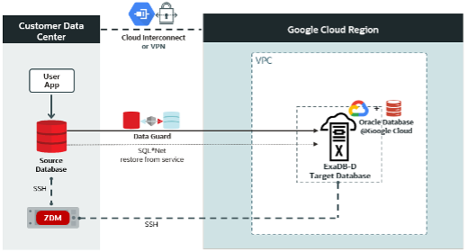



[Previous](index.md) [Next]() JavaScript must be enabled to correctly display this content 

  1. [Oracle Zero Downtime Migration](index.md)
  2. Oracle Zero Downtime Migration - Physical Online Migration to ExaDB-D on Oracle Database@Google Cloud

## Oracle Zero Downtime Migration - Physical Online Migration to ExaDB-D on Oracle Database@Google Cloud

[ABCDE-GUID-12790934581] 

### Purpose statement

[OracleZeroDowntimeMigrationPhysicalOnlineMigrationtoExaDBDonOracleDatabase@GoogleCloud-Purposestatement] 

Oracle customers are rapidly increasing their workload migration into the Oracle Cloud, Engineered Systems, and Oracle Database@Google Cloud. However, migrating workloads has been a source of challenges for many years. Migrating database workloads from one system to another or into the Cloud is easier said than done.

Based on years of experience migrating Oracle workloads, Oracle has developed Zero Downtime Migration (ZDM). ZDM is Oracle’s premier solution for a simplified and automated migration experience, providing zero to negligible downtime for the production system depending on the migration scenario. ZDM allows you to migrate your on-premises Oracle Databases directly and seamlessly to and between Oracle Database@Azure, Oracle Database@Google Cloud, Oracle Database@AWS, and any Oracle-owned infrastructure, including Exadata Database Machine On-Premises, Exadata Cloud at Customer, and Oracle Cloud Infrastructure. Oracle ZDM supports a wide range of Oracle Database versions and, as the name implies, ensures minimal to no production database impact during the migration.

ZDM follows Oracle Maximum Availability Architecture (MAA) principles[1] and incorporates products such as GoldenGate and Data Guard to ensure High Availability and an online migration workflow that leverages technologies such as the Recovery Manager, Data Pump, and Database Links. 

This technical brief is a step-by-step guide for migrating your on-premises Oracle Databases to Oracle Exadata Database Service on Dedicated Infrastructure (ExaDB-D) on Oracle Database@Google Cloud, with ZDM’s Physical Online workflow, specifically the Direct Data Transfer methodology.

Oracle ZDM will run on a separate node and connect to Source and Target to perform the migration. This guide will cover all requirements for installing the Oracle ZDM Service Host, the Source Database, the Target Database recipient of the migration process, and the networking used. The migration process will be dissected and done in a step-by-step fashion. This guide will answer the most frequently asked questions regarding the product and the overall migration process.

For more information on Oracle Zero Downtime Migration, please visit ZDM’s product website and Oracle Database@Google Cloud product website.[2]

Disclaimer

This document in any form, software or printed matter, contains proprietary information that is the exclusive property of Oracle. Your access to and use of this confidential material is subject to the terms and conditions of your Oracle software license and service agreement, which has been executed and with which you agree to comply. This document and information contained herein may not be disclosed, copied, reproduced or distributed to anyone outside Oracle without prior written consent of Oracle. This document is not part of your license agreement nor can it be incorporated into any contractual agreement with Oracle or its subsidiaries or affiliates.

This document is for informational purposes only and is intended solely to assist you in planning for the implementation and upgrade of the product features described. It is not a commitment to deliver any material, code, or functionality, and should not be relied upon in making purchasing decisions. The development, release, timing, and pricing of any features or functionality described in this document remains at the sole discretion of Oracle. Due to the nature of the product architecture, it may not be possible to safely include all features described in this document without risking significant destabilization of the code.

### Table of Contents

[OracleZeroDowntimeMigrationPhysicalOnlineMigrationtoExaDBDonOracleDatabase@GoogleCloud-TableofContents] 

  * Purpose statement
  * Table of Contents
  * Zero Downtime Migration
    * Supported Configurations
  * Architecture
    * Zero Downtime Migration Service Host
      * Zero Downtime Migration Service Host Requirements
    * Network and Connectivity
    * Source Database
    * Target Database
    * Source and Target Database Pre-Requisites
    * Additional Configuration
      * SSH Key
      * TDE Wallet
  * Database Migration Step by Step with ZDM
    * Step 1: Prepare the Source Database Host On-Premises
    * Step 2: Prepare the Source Database On-Premises
    * Step 3: Prepare the target database host on ExaDB-D on Oracle Database@Google Cloud
    * Step 4: Prepare the ZDM Service Host On-Premises
    * Step 5: Set SQL*Net connectivity between source and target database hosts
    * Step 6: Create the Physical Online Migration Response File on the ZDM host
    * Step 7: Evaluate the Configuration
    * Step 8: Initiate the Migration
    * Step 9: Complete the Migration
  * Known Issues
  * Troubleshooting & Other Resources
  * Footnotes

### Zero Downtime Migration

[OracleZeroDowntimeMigrationPhysicalOnlineMigrationtoExaDBDonOracleDatabase@GoogleCloud-ZeroDowntimeMigration] 

Oracle Zero Downtime Migration (ZDM) is the Oracle Maximum Availability Architecture (MAA)-recommended solution to migrate Oracle Databases to the Oracle Cloud. ZDM's inherent design keeps in mind the migration process as straightforward as possible to ensure the most negligible impact on production workloads. The Source Database to be migrated can be on-premises, deployed on Oracle Cloud Infrastructure, or a 3rd Party Cloud. The Target Database deployment can be on Oracle Database@Azure, Oracle Database@Google Cloud, Oracle Database@AWS, Database Cloud Service on Oracle Cloud Infrastructure (OCI) Virtual Machine, Exadata Cloud Service, Exadata Cloud at Customer, and Autonomous Database. ZDM automates the entire migration process, reducing the chance of human errors. ZDM leverages Oracle Database-integrated high availability (HA) technologies such as Oracle Data Guard and GoldenGate and follows all MAA best practices that ensure no significant downtime of production environments. Oracle ZDM supports both Physical and Logical Migration workflows. This technical brief covers a step-by-step guide for the Physical Online Migration Workflow leveraging Direct Data Transfer Methodology.

A standard Physical Online migration with Direct Data Transfer will take the following steps:

  1. Download and Configure ZDM. 
  2. ZDM Starts Database Migration. 
  3. ZDM Starts a Restore from Service Operation. 
  4. ZDM Instantiates a Standby Database. 
  5. ZDM Synchronizes Primary and Standby. 
  6. ZDM Switches Over & Swap Roles. 
  7. ZDM Performs Post Migration Validations. 
  8. ZDM Finalizes the Migration.

#### Supported Configurations

[OracleZeroDowntimeMigrationPhysicalOnlineMigrationtoExaDBDonOracleDatabase@GoogleCloud-SupportedConfigurations] 

Oracle ZDM supports Oracle Database versions 11.2.0.4, 12.1.0.2, 12.2.0.1, 18c, 19c, 21c, and 23ai. ZDM’s physical migration workflow requires the Source and Target Databases to be in the same database release.

Oracle ZDM supports Source Oracle Databases hosted on Linux, Solaris, and AIX operating systems. Oracle ZDM supports single-instance databases, Oracle RAC One Node databases, or Oracle RAC databases as sources. Oracle ZDM supports Oracle Database Enterprise & Standard Edition as Source and Target Databases. ZDM’s physical migration workflow supports only Source Databases hosted on Linux platforms.

### Architecture

[OracleZeroDowntimeMigrationPhysicalOnlineMigrationtoExaDBDonOracleDatabase@GoogleCloud-Architecture] 

An architectural overview of the ZDM Server, your source Database on-premises, the target database Oracle Exadata Database Service on Dedicated Infrastructure (ExaDB-D) on Oracle Database@Google Cloud, and all Networks and components required are described in the diagram below:

Figure 1. This is a High-Level Architectural overview showcasing the customer data center where the source database and ZDM’s server reside. It also shows all connectivity to the target Oracle Exadata Database Service on Dedicated Infrastructure (ExaDB-D) on Oracle Database@Google Cloud.

#### Zero Downtime Migration Service Host

[OracleZeroDowntimeMigrationPhysicalOnlineMigrationtoExaDBDonOracleDatabase@GoogleCloud-ZeroDowntimeMigrationServiceHost] 

##### Zero Downtime Migration Service Host Requirements

[OracleZeroDowntimeMigrationPhysicalOnlineMigrationtoExaDBDonOracleDatabase@GoogleCloud-ZeroDowntimeMigrationServiceHostRequirements] 

Oracle Zero Downtime Migration installation must take place on a separate host, which must fulfill the following requirements:

  * Linux host running on Oracle 7, 8, or RHEL 8 (only these OS platforms/versions are supported). 
  * 100 GB of free storage space. This space is required for all the logs that ZDM will generate. 
  * A zdm group and a zdmuser as part of this group. 
  * The following packages must be installed: 
    * glibc-devel 
    * expect 
    * unzip 
    * libaio 
    * oraclelinux-developer-release-el7
  * All hostnames and IP addresses to be used must be present as entries in the /etc/hosts file.

For more information on the ZDM Service Host requirements and setting up ZDM on RHEL platforms, please refer to Oracle ZDM’s product documentation, specifically “Setting Up Zero Downtime Migration Software” section[3].

For this step-by-step guide, the ZDM Service Host runs on-premises on an Oracle Linux Server 8.9. The host private IP is masked for this guide, but as an example we will use the fictional _**zz.dd.mm.hh**_ and the hostname is  _**zdmhost**_.

#### Network and Connectivity

[OracleZeroDowntimeMigrationPhysicalOnlineMigrationtoExaDBDonOracleDatabase@GoogleCloud-NetworkandConnectivity] 

**Google Cloud Region****  
**A Google Cloud region is a geographical area that contains data centers and infrastructure for hosting resources. It is made up of zones that are isolated from each other within the region.

**Google Cloud Project**  
A Google Cloud Project is required to use Google Workspace APIs and build Google Workspace add-ons or apps. A Cloud project forms the basis for creating, enabling, and using all Google Cloud services, including managing APIs, enabling billing, adding and removing collaborators, and managing permissions.

**Google Virtual Private Cloud  
** Google Cloud Virtual Private Cloud (VPC) provides networking functionality to Compute Engine virtual machine (VM) instances, Google Kubernetes Engine (GKE) containers, database services, and serverless workloads. VPC provides global, scalable, and flexible networking for your cloud-based service.

**Google Cloud Interconnect**  
Cloud Interconnect extends your on-premises network to the Google network through a highly available, low-latency connection. You can use Dedicated Interconnect to connect directly to Google or Partner Interconnect to connect to Google through a supported service provider.

**Oracle Exadata Database Service**  
Oracle Exadata Database Service enables you to leverage the power of Exadata in the cloud. It delivers proven Oracle Database capabilities on purpose-built, optimized Oracle Exadata infrastructure in the public cloud and on Cloud@Customer. Built-in cloud automation, elastic resource scaling, security, and fast performance for all Oracle Database workloads help you simplify management and reduce costs.

#### Source Database

[OracleZeroDowntimeMigrationPhysicalOnlineMigrationtoExaDBDonOracleDatabase@GoogleCloud-SourceDatabase] 

The source database runs on-premises on an Oracle Linux Server 7.7 for this step-by-step guide. The host private IP is masked for this guide, but as an example, we will use the fictional aa.bb.sr.db address, and the hostname is  _**onphost**_.

The source Oracle database is a single-instance Enterprise Edition database version 19.21 with multitenant architecture. The database name is _**oradb**_ _, and it_ s unique name is **_oradb_onp_**.

#### Target Database

[OracleZeroDowntimeMigrationPhysicalOnlineMigrationtoExaDBDonOracleDatabase@GoogleCloud-TargetDatabase] 

Oracle Database@Google Cloud offers the following products:

  * **Oracle Exadata Database Service on Dedicated Infrastructure (ExaDB-D)**
    * You can provision flexible Exadata systems that allow you to add database compute servers and storage servers to your system anytime after provisioning.  
  

  * **Oracle Autonomous Database Serverless (ADB-S)**
    * Autonomous Database provides an easy-to-use, fully autonomous database that scales elastically, delivers fast query performance, and requires no database administration.

Oracle Database@Google Cloud integrates Oracle Exadata Database Service, Oracle Real Application Clusters (Oracle RAC), and Oracle Data Guard technologies into the Google Cloud platform. The Oracle Database service runs on Oracle Cloud Infrastructure (OCI) and is co-located in Google’s data centers. The service offers features and price parity with OCI.

Oracle Database@Google Cloud service offers the same low latency as other Google-native services and meets mission-critical workloads and cloud-native development needs. Users manage the service on the Google Cloud console and with Google Cloud automation tools. The service is deployed in Google Virtual Private Cloud (VPC). The service requires that users have a Google Cloud Project and an OCI tenancy.

For this step-by-step guide, the target platform is Oracle Exadata Database Service on Dedicated Infrastructure (ExaDB-D) on Oracle Database@Google Cloud. The infrastructure contains a 2-node VM cluster. The VM cluster host private IPs are masked for this guide, but as an example, we will use the fictional **ta.db.og.1** and **ta.db.og.2** , and the host names are _**exadbgoogle1**_ and _**exadbgoogle2**_.

ZDM requires configuring a placeholder database target environment before beginning the migration process.

The target Oracle database is a 2-node Oracle RAC version 19.22 with multitenant architecture created using Oracle Cloud Console. The database name is  _**oradb**_(the same as the source database)_, and the database's unique name is**oradb_exa** (different from the source database’s_ _unique name)._

#### Source and Target Database Pre-Requisites

[OracleZeroDowntimeMigrationPhysicalOnlineMigrationtoExaDBDonOracleDatabase@GoogleCloud-SourceandTargetDatabasePre-Requisites] 

Oracle ZDM uses the provisioned placeholder database target as a template and recreates the target as a standby database from the source during migration. The following prerequisites must be met before starting the migration process:

  * The target database must be provisioned using Oracle Cloud Tooling without enabling automatic backups. 
  * The source and target databases must have the same database name (DB_NAME). 
  * The source and target databases must have different database unique names (DB_UNIQUE_NAME). 
  * The source and target databases must use a server parameter file (SPFILE). 
  * The source and target databases must use the same character set. 
  * The source and target databases must have the same encryption algorithm defined in the sqlnet.ora file. 
  * The SYS user account password must be the same on the source and target databases. 
  * The COMPATIBLE database initialization parameter must be the same on the source and target databases. 
  * The source and target databases must have the same major release version (e.g., 19c). However, the target database could have a higher patch level (e.g., source at 19.21 and target at 19.22). If the target database is at a higher patch than the source database, ZDM automatically runs datapatch as part of the migration. 
  * The target database must have a time zone file version that is the same or higher than the source database. 
  * For Oracle Database 12c Release 2 and later, the TDE wallet must exist on the source, and the wallet status must be OPEN. The source database does not necessarily need to be encrypted, but a TDE wallet must be configured. 
  * ZDM requires the SSH key on the ZDM Service Host to be in RSA format (In Oracle Linux 8, the default is OpenSSH).

#### Additional Configuration

[OracleZeroDowntimeMigrationPhysicalOnlineMigrationtoExaDBDonOracleDatabase@GoogleCloud-AdditionalConfiguration] 

##### SSH Key

[OracleZeroDowntimeMigrationPhysicalOnlineMigrationtoExaDBDonOracleDatabase@GoogleCloud-SSHKey] 

Check the key format:
    
    
    [zdmuser@zdmhost ~]$ head -n1 id_rsa

Create an SSH Key in RSA format (if not already created):
    
    
    [zdmuser@zdmhost ~]$ ssh-keygen -m PEM -t rsa

Change an existing SSH key into RSA format (if already created and need to reformat):
    
    
    [zdmuser@zdmhost ~]$ ssh-keygen -p -m PEM -f id_rsa

##### TDE Wallet

[OracleZeroDowntimeMigrationPhysicalOnlineMigrationtoExaDBDonOracleDatabase@GoogleCloud-TDEWallet] 

If your source database is not TDE enabled, follow these steps to create an auto-login wallet. Please visit the Database Reference guide for more information regarding the WALLET_ROOT parameter.[4]
    
    
    mkdir $ORACLE_BASE/admin/$ORACLE_SID/wallet
    
    mkdir $ORACLE_BASE/admin/$ORACLE_SID/wallet/tde
    
    
    alter session set container=cdb$root;
    
    alter system set wallet_root='$ORACLE_BASE/admin/$ORACLE_SID/wallet' scope=spfile;
    
    shutdown immediate;
    
    startup;
    
    
    alter system set tde_configuration='KEYSTORE_CONFIGURATION=FILE' scope=both;
    
    administer key management create keystore identified by \<your_TDE_password>;
    
    administer key management set keystore open identified by \<your_TDE_password> container=ALL;
    
    administer key management set key identified by \<your_TDE_password> with backup container=ALL;
    
    administer key management create auto_login keystore from keystore '$ORACLE_BASE/admin/$ORACLE_SID/wallet/tde' identified by \<your_TDE_password>;
    
    administer key management set keystore close identified by \<your_TDE_password> container=ALL;
    
    select * from v$encryption_wallet; --will open the auto-login wallet
    
    
    
    set lines 300
    
    set pages 100
    
    col name for a20
    
    col wrl_type for a10
    
    col status for a15
    
    col wallet_order for a15
    
    col key_id for a60
    
    col keystore_type for a20
    
    col origin for a20
    
    col encryptionalg for a15
    
    col encryptedts for a15
    
    col inst_id for 999
    
    col value for a60
    
    
    
    select p.con_id, p.name, p.open_mode, ew.wrl_type, ew.wallet_type, ew.status, ew.wallet_order
    
    from v$pdbs p join v$encryption_wallet ew on (ew.con_id = p.con_id)
    
    order by p.con_id;
    
    
    
        CON_ID NAME                 OPEN_MODE  WRL_TYPE   WALLET_TYPE          STATUS          WALLET_ORDER
    
    ---------- -------------------- ---------- ---------- -------------------- --------------- ---------------
    
             2 PDB$SEED             READ ONLY  FILE       AUTOLOGIN            OPEN            SINGLE
    
             4 OPDB4                READ WRITE FILE       AUTOLOGIN            OPEN            SINGLE
    
    
    
    select con_id, key_id, keystore_type, origin from v$encryption_keys;
    
    
    
        CON_ID KEY_ID                                                       KEYSTORE_TYPE        ORIGIN
    
    ---------- ------------------------------------------------------------ -------------------- --------------------
    
             4 AXLpMpzxoU/dvxXhn/okVMkAAAAAAAAAAAAAAAAAAAAAAAAAAAAA         SOFTWARE KEYSTORE    LOCAL
    
             1 ASYIe3UpY08bvxPooYkRBX0AAAAAAAAAAAAAAAAAAAAAAAAAAAAA         SOFTWARE KEYSTORE    LOCAL

### Database Migration Step by Step with ZDM

[OracleZeroDowntimeMigrationPhysicalOnlineMigrationtoExaDBDonOracleDatabase@GoogleCloud-DatabaseMigrationStepbyStepwithZDM] 

#### Step 1: Prepare the Source Database Host On-Premises

[OracleZeroDowntimeMigrationPhysicalOnlineMigrationtoExaDBDonOracleDatabase@GoogleCloud-Step1:PreparetheSourceDatabaseHostOn-Premises] 

  
Copy the SSH public key of the zdmuser from the ZDM host to the .ssh/authorized_keys file on the source database host for the user you want to use for login, in this case, **_onpuser_** :

On the ZDM host as zdmuser:
    
    
    [zdmuser@zdmhost ~]{{ARTICLE}}nbsp;cat .ssh/id_rsa.pub

On the source database host as user onpuser:
    
    
    [onpuser@onphost ~]$ vi .ssh/authorized_keys

Insert the public key and save the changes. Add the target database hostnames, IP addresses, and SCAN IP and name to the /etc/hosts file. As root user:
    
    
    [root@onphost ~]# vi /etc/hosts

Add the following entries:
    
    
    ta.db.og.1 exadbgoogle1.oraclevcn.com exadbgoogle1
    ta.db.og.2 exadbgoogle2.oraclevcn.com exadbgoogle2
    ta.db.og.3 demo-scan-sample.oraclevcn.com target-scan

#### Step 2: Prepare the Source Database On-Premises

[OracleZeroDowntimeMigrationPhysicalOnlineMigrationtoExaDBDonOracleDatabase@GoogleCloud-Step2:PreparetheSourceDatabaseOn-Premises] 

Prepare the source database. As SYS user:
    
    
    -- To protect against unlogged direct writes in the primary database that cannot be propagated to the standby database, turn on FORCE LOGGING at the primary database:
    SQL> alter database force logging;
    SQL> select force_logging from v$database;
    FORCE_LOGGING
    ---------------------------------------
    YES
    -- Enable ARCHIVELOG mode for the database:
    SQL> select log_mode from v$database;
    LOG_MODE
    ------------
    ARCHIVELOG
    -- For Oracle Database 12c Release 2 and later, it is mandatory to configure TDE before migration begins
    SQL> select wrl_type, status from v$encryption_wallet;
    WRL_TYPE             STATUS
    -------------------- ------------------------------
    FILE                 OPEN
    -- Set RMAN CONFIGURE CONTROLFILE AUTOBACKUP to ON
    RMAN> CONFIGURE CONTROLFILE AUTOBACKUP ON;

#### Step 3: Prepare the target database host on ExaDB-D on Oracle Database@Google Cloud

[OracleZeroDowntimeMigrationPhysicalOnlineMigrationtoExaDBDonOracleDatabase@GoogleCloud-Step3:PreparethetargetdatabasehostonExaDB-DonOracleDatabase@GoogleCloud] 

Copy the SSH public key of the zdmuser from the ZDM host to the .ssh/authorized_keys file on the target database hosts for the user you want to use for login; in this case, OPC:

On the ZDM host as zdmuser:
    
    
    [zdmuser@zdmhost ~]$ cat .ssh/id_rsa.pub

On the target database hosts as user opc (on all VMs of the VM cluster):
    
    
    [opc@ exadbgoogle1 ~]$ vi .ssh/authorized_keys

Insert the public key and save the changes
    
    
    [opc@ exadbgoogle2 ~]$ vi .ssh/authorized_keys

Insert the public key and save the changes

Add the source database hostname and IP information into the /etc/hosts file. As root user (on all VMs of the VM cluster):
    
    
    [root@ exadbgoogle1 ~]# vi /etc/hosts

Add the following entries
    
    
    aa.bb.sr.db onphost
    
    
    [root@ exadbgoogle2 ~]# vi /etc/hosts

Add the following entries
    
    
    aa.bb.sr.db onphost

#### Step 4: Prepare the ZDM Service Host On-Premises

[OracleZeroDowntimeMigrationPhysicalOnlineMigrationtoExaDBDonOracleDatabase@GoogleCloud-Step4:PreparetheZDMServiceHostOn-Premises] 

Add the source and target hostnames and IP addresses into the /etc/hosts file. As root user:
    
    
    [root@zdmhost ~]# vi /etc/hosts

Add the following entries
    
    
    ta.db.og.1 exadbgoogle1
    ta.db.og.2 exadbgoogle2
    aa.bb.sr.db onphost

Test the SSH connectivity to the source and target database hosts:
    
    
    [zdmuser@zdmhost ~]$ ssh -i /home/zdmuser/.ssh/id_rsa onpuser@onphost
    [zdmuser@zdmhost ~]$ ssh -i /home/zdmuser/.ssh/id_rsa opc@exadbgoogle1
    [zdmuser@zdmhost ~]$ ssh -i /home/zdmuser/.ssh/id_rsa opc@exadbgoogle2

Verify that TTY is disabled for the SSH-privileged user. If TTY is disabled, the following command returns the date from the remote host without any errors:
    
    
    [zdmuser@zdmhost ~]$ ssh -oStrictHostKeyChecking=no -i /home/zdmuser/.ssh/id_rsa onpuser@onphost "/usr/bin/sudo /bin/sh -c date"
    [zdmuser@zdmhost ~]$ ssh -oStrictHostKeyChecking=no -i /home/zdmuser/.ssh/id_rsa opc@ exadbgoogle1 "/usr/bin/sudo /bin/sh -c date"
    [zdmuser@zdmhost ~]$ ssh -oStrictHostKeyChecking=no -i /home/zdmuser/.ssh/id_rsa opc@ exadbgoogle2 "/usr/bin/sudo /bin/sh -c date"

These commands should execute without any prompting and return the date from the remote host. 

#### Step 5: Set SQL*Net connectivity between source and target database hosts

[OracleZeroDowntimeMigrationPhysicalOnlineMigrationtoExaDBDonOracleDatabase@GoogleCloud-Step5:SetSQL*Netconnectivitybetweensourceandtargetdatabasehosts] 

Check the SQL*Net network connectivity from source to target and vice versa:

From the source host on-premises
    
    
    [oracle@onphost ~]$ tnsping exadbgoogle1:1521
    [oracle@onphost ~]$ tnsping exadbgoogle2:1521

From target hosts on ExaDB-D on Oracle Database@Google Cloud
    
    
    [oracle@exadbgoogle1 ~]$ . oradb.env
    [oracle@exadbgoogle1 ~]$ tnsping onphost:1521
    [oracle@exadbgoogle2 ~]$ . oradb.env
    [oracle@exadbgoogle2 ~]$ tnsping onphost:1521

#### Step 6: Create the Physical Online Migration Response File on the ZDM host

[OracleZeroDowntimeMigrationPhysicalOnlineMigrationtoExaDBDonOracleDatabase@GoogleCloud-Step6:CreatethePhysicalOnlineMigrationResponseFileontheZDMhost] 

You’ll find a template on the ZDM host at $ZDMHOME/rhp/zdm/template/zdm_template.rsp, briefly describing the parameters and their possible values. Here, we will create a new response file with the minimal parameters required. As zdmuser:
    
    
    [zdmuser@zdmhost ~]$ vi /home/zdmuser/physical_online/physical_online.rsp

Add the following parameters and save the changes
    
    
    MIGRATION_METHOD=ONLINE_PHYSICAL
    DATA_TRANSFER_MEDIUM=DIRECT
    ZDM_RMAN_DIRECT_METHOD=RESTORE_FROM_SERVICE
    ZDM_SRC_DB_RESTORE_SERVICE_NAME=oradb
    TGT_DB_UNIQUE_NAME=oradb_exa
    PLATFORM_TYPE=EXACS

#### Step 7: Evaluate the Configuration

[OracleZeroDowntimeMigrationPhysicalOnlineMigrationtoExaDBDonOracleDatabase@GoogleCloud-Step7:EvaluatetheConfiguration] 

Execute the following command on the ZDM host as zdmuser to evaluate the migration. ZDM will check the source and target database configurations. The actual migration will not be started. On the ZDM host as zdmuser:
    
    
    Enter source database oradb SYS password:
    Enter source database oradb TDE keystore password:
    zdmhost: 2024-08-22T17:53:30.001Z : Processing response file ...
    Operation "zdmcli migrate database" scheduled with the job ID "1".
    If the source database uses ASM for storage management, use -sourcedb \<db_unique_name> instead of -sourcesid \<SID> in the zdmcli command.

Check the job status. On the ZDM host as zdmuser:
    
    
    [zdmuser@zdmhost ~]$ $ZDMHOME/bin/zdmcli query job -jobid 1
    ...
    Job ID: 1
    User: zdmuser
    Client: zdmhost
    Job Type: "EVAL"
    ...
    Current status: SUCCEEDED
    Result file path: "/home/zdmuser/zdm/zdmbase/chkbase/scheduled/job-1-2024-08-22-17:54:18.log"
    Metrics file path: "/home/zdmuser/zdm/zdmbase/chkbase/scheduled/job-1-2024-08-22-17:54:18.json"
    ...
    ZDM_GET_SRC_INFO ........... PRECHECK_PASSED
    ZDM_GET_TGT_INFO ........... PRECHECK_PASSED
    ZDM_PRECHECKS_SRC .......... PRECHECK_PASSED
    ZDM_PRECHECKS_TGT .......... PRECHECK_PASSED
    ZDM_SETUP_SRC .............. PRECHECK_PASSED
    ZDM_SETUP_TGT .............. PRECHECK_PASSED
    ZDM_PREUSERACTIONS ......... PRECHECK_PASSED
    ZDM_PREUSERACTIONS_TGT ..... PRECHECK_PASSED
    ZDM_VALIDATE_SRC ........... PRECHECK_PASSED
    ZDM_VALIDATE_TGT ........... PRECHECK_PASSED
    ZDM_POSTUSERACTIONS ........ PRECHECK_PASSED
    ZDM_POSTUSERACTIONS_TGT .... PRECHECK_PASSED
    ZDM_CLEANUP_SRC ............ PRECHECK_PASSED
    ZDM_CLEANUP_TGT ............ PRECHECK_PASSED

Detailed information about the migration process can be found by monitoring the log file:
    
    
    [zdmuser@zdmhost ~]$ tail -f /home/zdmuser/zdm/zdmbase/chkbase/scheduled/job-1-2024-08-22-17:54:18.log

In case troubleshooting is required, please check the ZDM server log on the ZDM Service Host under the following location:
    
    
    $ZDM_BASE/crsdata/\<zdm_service_host>/rhp/zdmserver.log.0

#### Step 8: Initiate the Migration

[OracleZeroDowntimeMigrationPhysicalOnlineMigrationtoExaDBDonOracleDatabase@GoogleCloud-Step8:InitiatetheMigration] 

To initiate the actual migration, execute the same command for evaluation, but this time without the -eval parameter.

Oracle ZDM allows you to pause the migration process at any given phase. For example, the migration process can be paused before the role swap and switchover phase. Upon executing the zdm migrate database command, the -pauseafter flag must be entered with the desired pausing stage, which in this case is ZDM_CONFIGURE_DG_SRC.

On the ZDM host as zdmuser:
    
    
    [zdmuser@zdmhost ~]$ $ZDMHOME/bin/zdmcli migrate database \
    -rsp /home/zdmuser/physical_online/physical_online.rsp \
    -sourcesid oradb \
    -sourcenode onphost \
    -srcauth zdmauth \
    -srcarg1 user:onpuser \
    -srcarg2 identity_file:/home/zdmuser/.ssh/id_rsa \
    -srcarg3 sudo_location:/usr/bin/sudo \
    -targetnode exadbgoogle1 \
    -tgtauth zdmauth \
    -tgtarg1 user:opc \
    -tgtarg2 identity_file:/home/zdmuser/.ssh/id_rsa \
    -tgtarg3 sudo_location:/usr/bin/sudo \
    -targethome /u02/app/oracle/product/19.0.0.0/dbhome_1 \
    -tdekeystorepasswd \
    -pauseafter ZDM_CONFIGURE_DG_SRC
    
    
    Enter source database oradb SYS password:
    Enter source database oradb TDE keystore password:
    zdmhost: 2024-08-22T17:57:20.003Z : Processing response file ...
    Operation "zdmcli migrate database" is scheduled with job ID "2".

Check the job status. On the ZDM host as zdmuser:
    
    
    [zdmuser@zdmhost ~]$ $ZDMHOME/bin/zdmcli query job -jobid 2
    ...
    Job ID: 2
    User: zdmuser
    Client: zdmhost
    Job Type: "MIGRATE"
    ...
    Current status: PAUSED
    Result file path: "/home/zdmuser/zdm/zdmbase/chkbase/scheduled/job-2-2024-08-22-17:58:18.log"
    Metrics file path: "/home/zdmuser/zdm/zdmbase/chkbase/scheduled/job-2-2024-08-22-17:58:18.json"
    ...
    ZDM_GET_SRC_INFO .............. COMPLETED
    ZDM_GET_TGT_INFO .............. COMPLETED
    ZDM_PRECHECKS_SRC ............. COMPLETED
    ZDM_PRECHECKS_TGT ............. COMPLETED
    ZDM_SETUP_SRC ................. COMPLETED
    ZDM_SETUP_TGT ................. COMPLETED
    ZDM_PREUSERACTIONS ............ COMPLETED
    ZDM_PREUSERACTIONS_TGT ........ COMPLETED
    ZDM_VALIDATE_SRC .............. COMPLETED
    ZDM_VALIDATE_TGT .............. COMPLETED
    ZDM_DISCOVER_SRC .............. COMPLETED
    ZDM_COPYFILES ................. COMPLETED
    ZDM_PREPARE_TGT ............... COMPLETED
    ZDM_SETUP_TDE_TGT ............. COMPLETED
    ZDM_RESTORE_TGT ............... COMPLETED
    ZDM_RECOVER_TGT ............... COMPLETED
    ZDM_FINALIZE_TGT .............. COMPLETED
    ZDM_CONFIGURE_DG_SRC .......... COMPLETED
    ZDM_SWITCHOVER_SRC ............ PENDING
    ZDM_SWITCHOVER_TGT ............ PENDING
    ZDM_POST_DATABASE_OPEN_TGT .... PENDING
    ZDM_DATAPATCH_TGT ............. PENDING
    ZDM_MANIFEST_TO_CLOUD ......... PENDING
    ZDM_POST_MIGRATE_TGT .......... PENDING
    ZDM_POSTUSERACTIONS ........... PENDING
    ZDM_POSTUSERACTIONS_TGT ....... PENDING
    ZDM_CLEANUP_SRC ............... PENDING
    ZDM_CLEANUP_TGT ............... PENDING

Detailed information about the migration process can be found by monitoring the log file:
    
    
    [zdmuser@zdmhost ~]$ tail -f /home/zdmuser/zdm/zdmbase/chkbase/scheduled/job-2-2024-08-22-17:58:18.log

The current job is in PAUSED status now. Also, the progress stopped after phase ZDM_CONFIGURE_DG_SRC was COMPLETED. Check the database roles. The source is primary now, and the target is on standby:
    
    
    [oracle@onphost ~]$ sqlplus / as sysdba
    SQL> select database_role from v$database;
    DATABASE_ROLE
    ----------------
    PRIMARY
    
    [oracle@exadbgoogle1 ~]$ sqlplus / as sysdba
    SQL> select database_role from v$database;
    DATABASE_ROLE
    ----------------
    PHYSICAL STANDBY

At this stage, every change in the source database is immediately synchronized with the target database. Resume the job when your application is ready for migration.

#### Step 9: Complete the Migration

[OracleZeroDowntimeMigrationPhysicalOnlineMigrationtoExaDBDonOracleDatabase@GoogleCloud-Step9:CompletetheMigration] 

Resume the job from the previous step. On the ZDM host as zdmuser, resume the job and query the status until all phases are completed:
    
    
    [zdmuser@zdmhost ~]$ $ZDMHOME/bin/zdmcli query job -jobid 2
    ...
    ZDM_GET_SRC_INFO .............. COMPLETED
    ZDM_GET_TGT_INFO .............. COMPLETED
    ZDM_PRECHECKS_SRC ............. COMPLETED
    ZDM_PRECHECKS_TGT ............. COMPLETED
    ZDM_SETUP_SRC ................. COMPLETED
    ZDM_SETUP_TGT ................. COMPLETED
    ZDM_PREUSERACTIONS ............ COMPLETED
    ZDM_PREUSERACTIONS_TGT ........ COMPLETED
    ZDM_VALIDATE_SRC .............. COMPLETED
    ZDM_VALIDATE_TGT .............. COMPLETED
    ZDM_DISCOVER_SRC .............. COMPLETED
    ZDM_COPYFILES ................. COMPLETED
    ZDM_PREPARE_TGT ............... COMPLETED
    ZDM_SETUP_TDE_TGT ............. COMPLETED
    ZDM_RESTORE_TGT ............... COMPLETED
    ZDM_RECOVER_TGT ............... COMPLETED
    ZDM_FINALIZE_TGT .............. COMPLETED
    ZDM_CONFIGURE_DG_SRC .......... COMPLETED
    ZDM_SWITCHOVER_SRC ............ COMPLETED
    ZDM_SWITCHOVER_TGT ............ COMPLETED
    ZDM_POST_DATABASE_OPEN_TGT .... COMPLETED
    ZDM_DATAPATCH_TGT ............. COMPLETED
    ZDM_MANIFEST_TO_CLOUD ......... COMPLETED
    ZDM_POST_MIGRATE_TGT .......... COMPLETED
    ZDM_POSTUSERACTIONS ........... COMPLETED
    ZDM_POSTUSERACTIONS_TGT ....... COMPLETED
    ZDM_CLEANUP_SRC ............... COMPLETED
    ZDM_CLEANUP_TGT ............... COMPLETED

Finally, check the target database role:
    
    
    [oracle@exadbgoogle1 ~]$ sqlplus / as sysdba
    SQL> select database_role from v$database;
    DATABASE_ROLE
    ----------------
    PRIMARY

### Known Issues

[OracleZeroDowntimeMigrationPhysicalOnlineMigrationtoExaDBDonOracleDatabase@GoogleCloud-KnownIssues] 

All common issues are documented and updated periodically in Oracle Zero Downtime Migration’s documentation, specifically on the product release note, Known Issues section: 

\<https://docs.oracle.com/en/database/oracle/zero-downtime-migration/>

### Troubleshooting & Other Resources

[OracleZeroDowntimeMigrationPhysicalOnlineMigrationtoExaDBDonOracleDatabase@GoogleCloud-Troubleshooting&OtherResources] 

For Oracle ZDM log review:

  * ZDM Server Logs: 
    * Check - $ZDM_BASE/crsdata/\<zdm_service_node>/rhp/rhpserver.log.0  
  

  * Check source node logs 
    * \- \<oracle_base>/zdm/zdm_\<src_db_name>_\<job_id>/zdm/log  
  

  * Check target node logs. 
    * \- \<oracle_base>/zdm/zdm_\<tgt_db_name>_\<job_id>/zdm/log

For all Oracle Support Service Requests related to Zero Downtime Migration, please be sure to follow the instructions in My Oracle Support Document:

  * SRDC – Data Collection for Database Migration Using Zero Downtime Migration (ZDM) (DOC ID 2595205.1) 
  * \<https://support.oracle.com/epmos/faces/DocContentDisplay?id=2595205.1>

### Footnotes

[OracleZeroDowntimeMigrationPhysicalOnlineMigrationtoExaDBDonOracleDatabase@GoogleCloud-Footnotes] 

[1] \<https://oracle.com/goto/maa>

[2] \<https://www.oracle.com/goto/zdm>  
\<https://www.oracle.com/cloud/google/oracle-database-at-google-cloud/>

[3] \<https://docs.oracle.com/en/database/oracle/zero-downtime-migration/index.md>

[4] \<https://docs.oracle.com/en/database/oracle/oracle-database/19/refrn/WALLET_ROOT.md>

  

